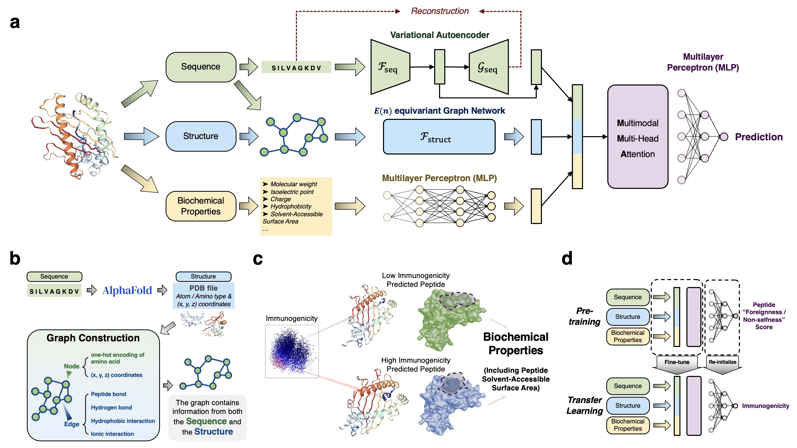
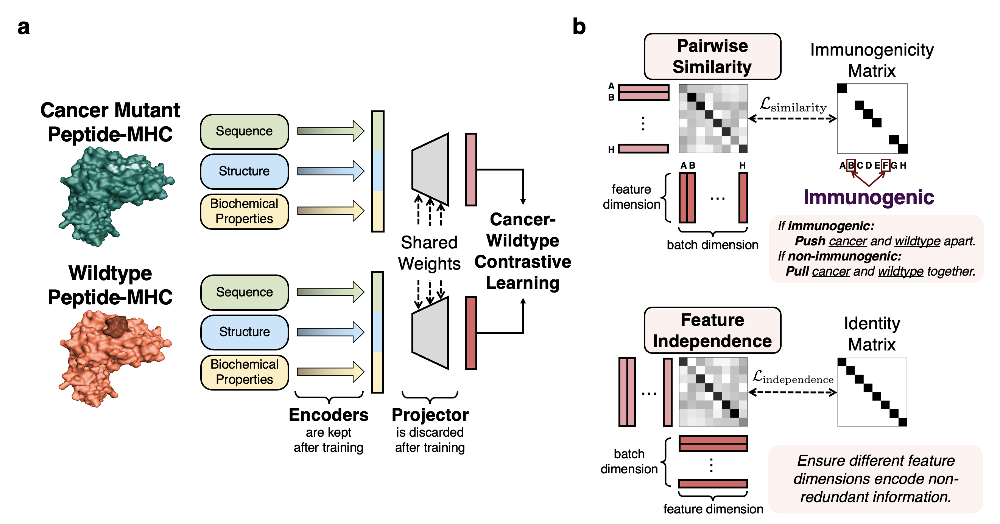

<a id="readme-top"></a>

<!-- PROJECT LOGO -->

<div align="center">

  <h1 align="center">ImmunoStruct</h1>

<!-- PROJECT SHIELDS -->
[](https://www.biorxiv.org/content/10.1101/2024.11.01.621580)
[](https://twitter.com/KrishnaswamyLab)
[](https://github.com/KrishnaswamyLab/ImmunoStruct)

  <p align="center">
    A multimodal neural network framework for immunogenicity prediction from peptide-MHC sequence, structure, and biochemical properties
    <br />
    <a href="https://www.biorxiv.org/content/10.1101/2024.11.01.621580"><strong>Explore the paper »</strong></a>
    <br />
    <br />
  </p>
</div>


<!-- TABLE OF CONTENTS -->
<details>
  <summary>Table of Contents</summary>
  <ol>
    <li>
      <a href="#about-the-project">About The Project</a>
      <ul>
        <li><a href="#key-features">Key Features</a></li>
        <li><a href="#built-with">Built With</a></li>
      </ul>
    </li>
    <li>
      <a href="#getting-started">Getting Started</a>
      <ul>
        <li><a href="#prerequisites">Prerequisites</a></li>
        <li><a href="#installation">Installation</a></li>
      </ul>
    </li>
    <li><a href="#usage">Usage</a></li>
    <li><a href="#model-architecture">Model Architecture</a></li>
    <li><a href="#troubleshooting">Troubleshooting</a></li>
    <li><a href="#contributing">Contributing</a></li>
    <li><a href="#license">License</a></li>
    <li><a href="#contact">Contact</a></li>
    <li><a href="#citation">Citation</a></li>
    <li><a href="#acknowledgments">Acknowledgments</a></li>
  </ol>
</details>

<!-- ABOUT THE PROJECT -->
## About The Project

<div align="center">
  
</div>

ImmunoStruct is a deep learning framework that integrates sequence, structural, and biochemical information to predict multi-allele class-I peptide-MHC immunogenicity. By leveraging multimodal data from ~27,000 peptide-MHCs, ImmunoStruct significantly improves immunogenicity prediction performance for both infectious disease epitopes and cancer neoepitopes.

<p align="right">(<a href="#readme-top">back to top</a>)</p>

### Key Features

* **Multimodal Integration**: Combines protein sequence, structure, and biochemical properties
* **Novel Cancer-Wildtype Contrastive Learning**: Enhances specificity for cancer neoepitope detection  
* **Enhanced Interpretability**: Provides insights into the molecular basis of immunogenicity

<div align="center">
  
</div>

<p align="right">(<a href="#readme-top">back to top</a>)</p>


<!-- GETTING STARTED -->
## Getting Started

To get ImmunoStruct up and running locally, follow these steps.

### Pre-requisites

Before installation, ensure you have:
* Python 3.10+
* CUDA-compatible GPU (recommended)
* Conda package manager
* Weights & Biases account for experiment tracking

### Dependencies
- python 3.10
- torch 2.1.2
- dgl
- torch_geometric 2.5.3

### Installation

1. **Clone the repository**
   ```sh
   git clone https://github.com/KrishnaswamyLab/ImmunoStruct.git
   cd ImmunoStruct
   ```

2. **Create and activate conda environment**
   ```sh
   conda create --name immuno python=3.10 -c anaconda -c conda-forge
   conda activate immuno
   ```

3. **Install core dependencies**
   ```sh
   conda install cudatoolkit=11.2 wandb pydantic -c conda-forge
   conda install scikit-image pillow matplotlib seaborn tqdm -c anaconda
   ```

4. **Install PyTorch**
   ```sh
   python -m pip install torch==2.1.2 torchvision==0.16.2 torchaudio==2.1.2 --index-url https://download.pytorch.org/whl/cu118
   ```

5. **Install DGL**
   ```sh
   python -m pip install dgl -f https://data.dgl.ai/wheels/torch-2.1/cu118/repo.html
   python -m pip install torchdata==0.7.1
   ```

6. **Install PyTorch Geometric and related packages**
   ```sh
   python -m pip install torch-scatter==2.1.2+pt21cu118 torch-sparse==0.6.18+pt21cu118 torch-cluster==1.6.3+pt21cu118 torch-spline-conv==1.2.2+pt21cu118 torch_geometric==2.5.3 numpy==1.26.3 -f https://data.pyg.org/whl/torch-2.1.2+cu118.html
   ```

7. **Install additional packages**
   ```sh
   python -m pip install graphein[extras]
   python -m pip install lifelines
   python -m pip install -U phate
   python -m pip install multiscale-phate
   ```

8. **Set up environment variables (if needed)**
   ```sh
   export LD_LIBRARY_PATH=/path/to/conda/envs/immuno/lib:$LD_LIBRARY_PATH
   ```

<p align="right">(<a href="#readme-top">back to top</a>)</p>

<!-- USAGE EXAMPLES -->
## Usage

### Data Preparation

Place the following files in the `data/` folder:
- `cedar_data_final_with_mprop1_mprop2_v2.txt`
- `complete_score_Mprops_1_2_smoothed_sasa_v2.txt`
- `HLA_27_seqs_csv.csv`

Additionally, ensure you have these folders:
- `graph_pyg_Cancer`
- `graph_pyg_IEDB`

**Generate PyG graph files:**

These PyG graph files can be generated using the below command from the corresponding AlphaFold folders.
```sh
python immunostruct/preprocessing/cancer_graph_construction_new_KBG.py
```


### Training and Testing

1. **Set up Weights & Biases**
   
   Create a project on [Weights & Biases](https://wandb.ai/home) matching your project name.

2. **Run Experiments**
   ```sh
   # HybridModelv2 with full sequence and sequence loss
   python train_PropIEDB_PropCancer_ImmunoCancer.py --full-sequence --sequence-loss --model HybridModelv2 --wandb-username YOUR_WANDB_USERNAME
   
   # HybridModel with full sequence and sequence loss
   python train_PropIEDB_PropCancer_ImmunoCancer.py --full-sequence --sequence-loss --model HybridModel --wandb-username YOUR_WANDB_USERNAME
   
   # Sequence with fingerprint model
   python train_PropIEDB_PropCancer_ImmunoCancer.py --full-sequence --sequence-loss --model SequenceFpModel --wandb-username YOUR_WANDB_USERNAME
   
   # Sequence-only model
   python train_PropIEDB_PropCancer_ImmunoCancer.py --full-sequence --sequence-loss --model SequenceModel --wandb-username YOUR_WANDB_USERNAME
   
   # Structure-only model
   python train_PropIEDB_PropCancer_ImmunoCancer.py --full-sequence --model StructureModel --wandb-username YOUR_WANDB_USERNAME
   ```


<p align="right">(<a href="#readme-top">back to top</a>)</p>


<!-- TROUBLESHOOTING -->
## Troubleshooting

### Common Issues

**GLIBCXX Error**
```
ImportError: $some_path/libstdc++.so.6: version 'GLIBCXX_3.4.29' not found
```
**Solution:** Add your conda environment path to `LD_LIBRARY_PATH`:
```sh
export LD_LIBRARY_PATH=/path/to/conda/envs/immuno/lib:$LD_LIBRARY_PATH
```

**CUDA Compatibility Issues**
- Ensure your CUDA version matches the PyTorch installation
- Verify GPU availability with `torch.cuda.is_available()`

**Memory Issues**
- Reduce batch size in training scripts
- Use gradient checkpointing for large models

**Wandb Authentication**
- Login to Wandb: `wandb login`
- Ensure project names match between script and Wandb dashboard

<p align="right">(<a href="#readme-top">back to top</a>)</p>

<!-- LICENSE -->
## License

Distributed under the Yale License. See `LICENSE.txt` for more information.

<p align="right">(<a href="#readme-top">back to top</a>)</p>

<!-- CONTACT -->
## Contact

Krishnaswamy Lab - [@KrishnaswamyLab](https://twitter.com/KrishnaswamyLab)

Project Link: [https://github.com/KrishnaswamyLab/ImmunoStruct](https://github.com/KrishnaswamyLab/ImmunoStruct)

<p align="right">(<a href="#readme-top">back to top</a>)</p>

<!-- CITATION -->
## Citation

If you use ImmunoStruct in your research, please cite our paper:

```bibtex
@article{givechian2024immunostruct,
  title={ImmunoStruct: Integration of protein sequence, structure, and biochemical properties for immunogenicity prediction and interpretation},
  author={Givechian, Kevin Bijan and Rocha, Joao Felipe and Yang, Edward and Liu, Chen and Greene, Kerrie and Ying, Rex and Caron, Etienne and Iwasaki, Akiko and Krishnaswamy, Smita},
  journal={bioRxiv},
  pages={2024--11},
  year={2024},
  publisher={Cold Spring Harbor Laboratory}
}
```

<p align="right">(<a href="#readme-top">back to top</a>)</p>

<!-- MARKDOWN LINKS & IMAGES -->
[biorxiv-shield]: https://img.shields.io/badge/bioRxiv-ImmunoStruct-firebrick?style=for-the-badge
[biorxiv-url]: https://www.biorxiv.org/content/10.1101/2024.11.01.621580
[twitter-shield]: https://img.shields.io/twitter/follow/KrishnaswamyLab.svg?style=for-the-badge&logo=twitter&colorB=1DA1F2
[twitter-url]: https://twitter.com/KrishnaswamyLab
[stars-shield]: https://img.shields.io/github/stars/KrishnaswamyLab/ImmunoStruct.svg?style=for-the-badge
[stars-url]: https://github.com/KrishnaswamyLab/ImmunoStruct/stargazers
[issues-shield]: https://img.shields.io/github/issues/KrishnaswamyLab/ImmunoStruct.svg?style=for-the-badge
[issues-url]: https://github.com/KrishnaswamyLab/ImmunoStruct/issues
[license-shield]: https://img.shields.io/badge/license-Yale-blue.svg?style=for-the-badge
[license-url]: https://github.com/KrishnaswamyLab/ImmunoStruct/blob/master/LICENSE.txt
[PyTorch]: https://img.shields.io/badge/PyTorch-EE4C2C?style=for-the-badge&logo=pytorch&logoColor=white
[PyTorch-url]: https://pytorch.org/
[PyG]: https://img.shields.io/badge/PyTorch_Geometric-3C2179?style=for-the-badge&logo=pytorch&logoColor=white
[PyG-url]: https://pytorch-geometric.readthedocs.io/
[DGL]: https://img.shields.io/badge/DGL-FF6B35?style=for-the-badge&logo=python&logoColor=white
[DGL-url]: https://www.dgl.ai/
[Wandb]: https://img.shields.io/badge/Weights_&_Biases-FFBE00?style=for-the-badge&logo=weightsandbiases&logoColor=white
[Wandb-url]: https://wandb.ai/
[Python]: https://img.shields.io/badge/Python-3776AB?style=for-the-badge&logo=python&logoColor=white
[Python-url]: https://python.org/
[Conda]: https://img.shields.io/badge/Conda-44A833?style=for-the-badge&logo=anaconda&logoColor=white
[Conda-url]: https://conda.io/